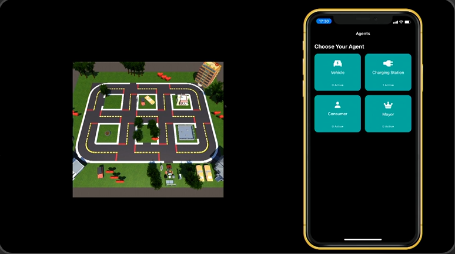

## Welcome to my page 

I like developing useful things and looking into fascinating new topics in Computer Science.

### About Me

I have done my Bachelor's degree in Information Systems at the Technical University of Munich, complemented by an exchange Semester at the Hong Kong University of Science and Technology. Throughout my studies I have worked at the Institute of Computational Biology Munich, Deutsche Bank and PwC. I also worked as a teaching assistant at my university for courses on Computer Science in the context of Business and Applied Software Engineering. 

### My Thesis : SpikeDecoder

I have written my project about a research topic that I have been interested in since before I started university. If you are a bit familiar with Artificial Intelligence and the structure that it operates on, you might have asked yourself, to what degree it reflects the way your brain operates. I have been wondering the same, ever since I learned about neural plasticity in high school. 
One of the most popular and impressive techniques of Artificial Intelligence is undoubtedly ChatGPT. The GPT architecture has been around for some time and is a classic example of an Artificial Neural Network with high capabilities. In order to replicate this architecture with similarity to the brain, I have looked into the structure of Spiking Neural Networks. "Spiking" refers to the capability of biological neurons to pass on the integrated charges it has received from previous neurons, by releasing transmitters in the intersynaptic cleft, exciting an adjacent neuron. This can be realized very energy-efficiently using neuromorphic hardware, however, due to the all-or-nothing behavior of the neurons, they do not inherently support a value range bigger than one. Instead, information may be propagated through the rate of spikes, or the exact timing. This field is still rather new, so even a weaker overall performance is a significant finding. If you are interested in looking further into my implementation, have a look at [my repository](https://github.com/ClaasBeger/SpikeDecoder).

[]

### Developing an iOS APP

At the Technical University of Munich, I have participated in the applied course iPraktikum, where student teams work together with industry partners to tackle real-life programs. I joined the team of industry partner Siemens, during which we created an orchestration system for industral robots. This was especially challenging because the program featured a user-base of both autonomous but also non-autonomous agents.

[]

If you are interested in diving deeper into this project, check out our design review and client acceptance test on the site of the [applied software engineering group](https://ase.cit.tum.de/projects/ipraktikum/22w/siemens/).

### Contact Me

